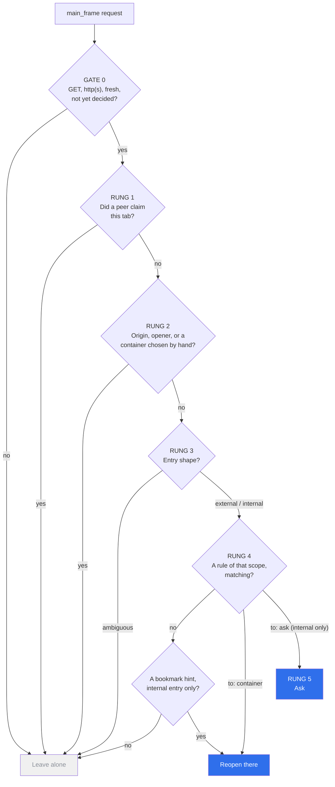

# container-commander

**One thing decides which Firefox container a tab opens in — once, at the
moment the tab is born, and never again.**

Firefox containers are excellent and their tooling fights itself. Run
Multi-Account Containers, Containerise and Folder Containers together and you
have three engines answering the same question from three different files, none
of which can see who asked. Add an app launcher and a link handler of your own
and you have five. They do not merge; they race, and the tie-break is a dialog
asking you to settle it by hand.

container-commander is the arbiter that makes the question have one answer. The
launcher and the link handler in that count are mine too —
[beeline](https://github.com/sapn95/beeline) opens apps and
[linkward](https://github.com/sapn95/linkward) catches links handed over from
outside the browser — and both announce a tab to commander _before_ they create
it instead of racing it, which is the whole reason this repository exists.

> **[Install it from addons.mozilla.org](https://addons.mozilla.org/en-US/firefox/addon/container-commander/)**
> — then read [docs/configuration.md](docs/configuration.md), because it ships no
> rules and does nothing at all until you give it a policy. That is the design,
> and the add-on's own page walks you through it.
>
> v0.2.1 is public. The architecture below survived a three-way design panel, two
> judges and four adversarial passes that found twenty-one breaks — every one
> repaired here. The tests were written first and the code was written to satisfy
> them: **274 specs, 94% statements**, 97% on the engine that makes every
> decision, with four of the catalogued failures carried as executable
> regressions and the other two designed out rather than tested for.

## The one idea

**A container is a property of a flow, not of a URL.**

Every failure in [the catalog](docs/failure-catalog.md) is the same mistake in
a different costume: a rule that matches a _URL_ was allowed to act on a _flow_
that was already under way. A sign-in host is shared by three identities. A
federation endpoint is shared by every application in a tenant. A cloud console
hostname carries the region, not the account. No pattern over those strings can
answer "which identity is this", because the string genuinely does not know.

So the decision happens **exactly once, at a flow's first request**, from the
best provenance available — and after that the flow is inherited, untouchable,
to the end.

## The ladder



Five of those fourteen edges end at **Leave alone**, and rung 4 is the only rung
with three ways out. A list cannot show either, which is why the same graph is
here and in the architecture rather than only there.

```
GATE 0  Scope        main_frame, http(s), GET, first navigation of a fresh tab.
                     Anything else is not ours. Never asks, never reopens.
RUNG 1  Claims       A cooperating extension said "this tab is mine" BEFORE it
                     created it. Outranks every rule, including deterministic ones.
RUNG 2  Inheritance  originUrl/documentUrl present, an opener, a non-default
                     container chosen by hand → leave alone without reading config.
                     This rung IS "auth follows caller".
RUNG 3  Entry shape  What survives is an entry. External-shaped or internal-shaped,
                     with an ambiguity band that resolves to silence.
RUNG 4  Entry rules  First match over a compiler-ordered list. External rules for
                     outside hand-offs, internal rules for in-browser entries.
RUNG 5  Ask          Only when a rule says so. Never a fallback.
RUNG 6  Leave alone  A named rung, not an else-branch. Every unknown lands here.
        ─────────────
OUT     Human override — the toolbar button, and "Reopen this tab in
        <container>" on the tab's own context menu. The only path by which a
        tab that already exists can be moved, and it reads no rule to do it.
```

Read it in full in [docs/architecture.md](docs/architecture.md); the reasoning
per decision is in [docs/adr/](docs/adr/).

## What it is not

- **Not a router that knows better.** Unknown, ambiguous, or broken config all
  land on rung 6 and the extension behaves as if it were not installed.
- **Not a writable rule store.** Policy is read-only, delivered by
  `storage.managed` from a file your config repo generates. "Remember" is
  session-scoped plus a snippet you paste into that repo. Nothing the extension
  can write can outlive the browser — that is what makes drift impossible.
- **Not live.** Firefox reads a managed manifest once per extension start. The
  popup shows which revision is loaded rather than pretending otherwise, and
  Reload is how you make a fresh one take effect.
- **Not a prompt.** For links arriving from outside the browser, asking belongs
  to [linkward](https://github.com/sapn95/linkward). The compiler refuses a
  config that would give commander a second prompt on the same territory.
- **Not Chromium.** Containers are a Firefox feature.

## Repository layout

|                           |                                                                                            |
| ------------------------- | ------------------------------------------------------------------------------------------ |
| `src/lib/engine.js`       | the pure core: `decide(input) → Decision`, no browser APIs, no clock                       |
| `src/background.js`       | the event page — arming, input assembly, and carrying out a `Decision`                     |
| `tests/`                  | the specification, executable; the code was written to satisfy it                          |
| `scripts/`                | the build, the artwork generators, and the allowlist that keeps this repo employer-neutral |
| `docs/configuration.md`   | **start here after installing**: where the policy file goes, and what goes in it           |
| `docs/architecture.md`    | the full design, post-adversarial                                                          |
| `docs/failure-catalog.md` | six failures observed in production, plus the platform terrain behind them                 |
| `docs/adr/`               | one file per decision a reviewer would question                                            |
| `docs/protocol.md`        | the four-message claim protocol                                                            |
| `docs/publishing.md`      | how a release reaches AMO — and why the policy file never does                             |
| `docs/store/`             | the AMO listing metadata, and the staged redraw the screenshots are captured from          |
| `docs/store/amo/`         | the screenshots the release uploads, in filename order — a directory per store             |
| `assets/`                 | the picture above, regenerated from the real popup by `npm run art`                        |
| `PRIVACY.md`              | what it looks at, what it keeps, and what it sends                                         |
| `LICENSE`                 | MIT                                                                                        |

## Development

```bash
npm ci
npm test                # vitest
npm run test:coverage   # vitest + v8 coverage
npm run lint            # eslint
npm run lint:leaks      # the allowlist that keeps employer identifiers out
npm run format          # prettier --write
npm run icons           # regenerate src/icons/*.png
npm run art             # regenerate the screenshots, from the real popup
npm run build           # -> dist/
npm run package         # dist/ + container-commander-vX.Y.Z.zip
npm run ci              # lint + leaks + format + coverage + package, the gate CI runs
npm run amo:art         # push the icon and screenshots to the AMO listing (needs credentials)
```

No bundler and no runtime dependencies: the source under `src/` **is** the
artifact, and `scripts/build.mjs` only copies it and stamps the version. An
extension that decides which identity your tabs open in should be readable end
to end by whoever reviews it, in the store and out of it.

[CI](.github/workflows/ci.yml) runs that gate on every pull request and then
`web-ext lint` over `dist/`, which is the check AMO itself runs — a package the
store would reject should go red here rather than in review.

## Installing

Not on addons.mozilla.org yet — v0.2.0 is submitted and in review. Until Mozilla
lists it, run it from a checkout:

```bash
npm ci && npm run build
```

then `about:debugging` → **This Firefox** → **Load Temporary Add-on** →
`dist/manifest.json`.

It will do **nothing at all** until two things are true, and the toolbar badge
carries a red `!` until both are — hover it and it names whichever is missing:

1. **It is allowed to watch navigation.** `webRequest` and `<all_urls>` are
   optional and asked for at runtime, from the add-on's own pages, because an
   add-on that demands "access your data for all websites" at install to do
   nothing until you also hand it a policy is one nobody installs. Click the
   toolbar button and grant it there.
2. **A policy exists.** The extension ships no rules by design; the policy
   arrives from your own config repository as a managed storage file — see
   [docs/publishing.md](docs/publishing.md#the-policy-file-is-not-part-of-the-release).

Neither is a broken install. The badge exists because the state where the
policy is loaded and the grant is missing used to look like a healthy one.

It makes no network requests of its own, and everything it remembers dies with
the browser: [PRIVACY.md](PRIVACY.md).

![The container commander popup. Under POLICY, the loaded revision — policy-2026.08.16-a1b2c3d, carrying the date it was compiled, because managed storage is read once per extension start and that date is the only honest answer to "is my edit live yet" — then 11 rule(s), a Reload policy button and a Pause for this session button, and the line that an emergency stop is Pause or disabling the add-on, never an emergency edit to the policy. Under RECENT DECISIONS, the last six, each an address followed by the verdict as action and the rung that settled it: flow.example-corp.com reopen·4, login.example-idp.com/oauth2/authorize leave·2, console.example-cloud.com leave·1, eu-1.console.example-cloud.com leave·4, docs.example.com leave·2, and intranet.example.com leave·0. Five of the six were left alone, which is the ordinary case. The reason behind each verdict is a hover tooltip and is not shown here.](assets/popup.png)

That popup is all there is to operate — which revision is loaded, and the last
decisions with the rung each was settled on, including and mostly the ones it
left alone. There is no settings screen, because the rules are not the
extension's to change. (The one other screen is the RUNG 5 picker, and it only
appears when a rule explicitly asks for it.)

A real capture of the running popup, with a policy staged for the picture: the
addresses are the failure catalogue's own.

## Licence

[MIT](LICENSE).
