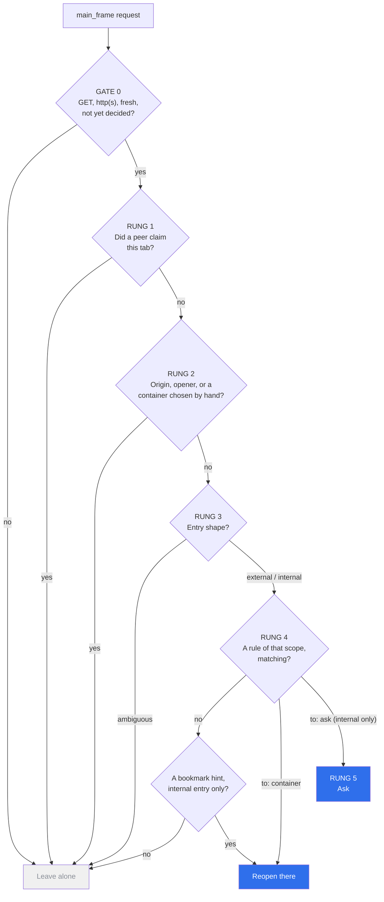

# Architecture

The design after a three-way panel, two judges, and four adversarial passes that
found twenty-one breaks. Everything marked **`Ax`** is a repair applied to the
winning design because an attack broke it; the attack is named so the reason
survives the next person who thinks the clause is redundant.

---

## 0. The ladder, at a glance

Read downwards. The first rung that answers, answers — and the ones above the
rules answer without reading config at all, which is what makes a redirect
structurally unable to meet a rule.



Rungs 1 and 2 are the whole of the failure catalogue. Everything below them is
ordinary configuration.

## 1. The single decision point

One listener decides, and it decides once:

```js
browser.webRequest.onBeforeRequest.addListener(
  onBeforeRequest,
  { urls: ['http://*/*', 'https://*/*'], types: ['main_frame'] },
  ['blocking'],
);
```

Registered **synchronously, at event-page top level, before any await**. The
MV3 background is an event page: only listeners added during the first
synchronous run are ones the browser can restart the page _for_. A listener
added after an `await` — on a permission check, say — is invisible to that
machinery, and the extension silently stops working once the page first idles
out. This is not theory; it shipped once in linkward and took a week to find.

Blocking `webRequest` is still supported in Firefox MV3 (verified — Mozilla has
stated it is not on a deprecation path). It is the only event that lets a
decision happen **before** anything is fetched.

`webNavigation.onCommitted` is used for **logging only**. It carries
`transitionType`, which would be lovely, and it arrives after the request, which
makes it useless for deciding. Reading it and then "correcting" the tab is
exactly failure F6 with extra steps.

---

## 2. GATE 0 — scope

A filter, not a decision. If any of these is false, the extension is inert for
this request and no config is even read:

| Condition                      | Why                                                                                                                                             |
| ------------------------------ | ----------------------------------------------------------------------------------------------------------------------------------------------- |
| `type === 'main_frame'`        | sub-resources are not flows                                                                                                                     |
| scheme is `http`/`https`       | nothing else can be reopened meaningfully                                                                                                       |
| **`method === 'GET'`**         | reopening is close-and-create, and `tabs.create` takes a URL — **a POST body cannot survive it**. Refusals are logged, never silently swallowed |
| tab is a _fresh candidate_     | see rung 3                                                                                                                                      |
| candidate flag not yet _spent_ | a tab is decided about once, whichever way it went                                                                                              |

The method guard is load-bearing and easy to lose in a refactor, so it is a
named gate with its own tests rather than a condition buried in a predicate.

---

## 3. RUNG 1 — claims

A cooperating extension announced ownership of a tab **before creating it**.

- Claims are **counted and URL-keyed**: `Map<url, FIFO queue of {cookieStoreId, sender, ts}>`.
  A plain boolean or a single-slot claim breaks when two launches race — a bug
  linkward already had and already fixed; the shape is inherited rather than
  rediscovered.
- Consumed at `tabs.onCreated`, matched against **both** `tab.url` and
  `tab.pendingUrl` — which of the two carries the address differs by browser and
  by version.
- Once consumed, the tab is hands-off **for its entire life**, not just for the
  first request.
- TTL is evaluated lazily at consume time. No timers: a timer in an event page is
  a promise the platform does not keep.

**`A5` `A9` Claims are awaited in every direction.** The original design had only
the launcher awaiting its claim reply. If a claim message loses a race against
the navigation it describes, a rule can shadow a claim — which is failure F4
returning through the front door. So: _no `tabs.create` may be issued before the
claim promise has settled_, with a short timeout (~200 ms) after which the caller
proceeds anyway, because a peer being absent is normal and must degrade to
standalone behaviour. Both invariants are pinned by tests in all three
repositories.

---

## 4. RUNG 2 — inheritance (this rung _is_ "auth follows caller")

Leave alone, **without reading config**, if any of:

- `originUrl` or `documentUrl` is present — a document started this. That covers
  every redirect, every link click, every form post, and therefore every hop of
  every sign-in flow after the first.
- an `openerTabId` is present.
- **`A19` `A20`** the tab's `cookieStoreId` is already a **non-default container**
  and no claim was consumed. Opening "New Container Tab → admin" by hand and
  typing an address is provenance too — the strongest kind, a human gesture. A
  rule silently reopening that tab elsewhere is the same insult as F1.

This is the whole of "authentication follows the caller", and it needs no
special case for authentication. A sign-in hop _always_ carries an origin, so it
_always_ stops here, so no rule can ever see it. The rule that cannot fire cannot
be wrong.

Defence in depth, because F1 cost a day: the compiler additionally **refuses**
a bare host pin on anything in `authHosts`, and the verifier carries F1 as an
executable regression, so a config edit reintroducing it fails the commit rather
than the login.

---

## 5. RUNG 3 — entry shape

What survives rung 2 is a genuine entry: a fresh tab, no opener, first
navigation. Classify it via the vendored `startedInsideBrowser()` — the focus
clock from linkward, where every focus _gain_ restarts the clock, because the
_loss_ of focus is the half neither browser reports reliably.

**`A17` The ambiguity band.** linkward and commander both classify entries, and
if they disagree at the boundary both may act. So commander may call an entry
_internal-shaped_ only when the focus age is at least **twice** the grace period
(`internalMarginMs`, default = `focusGraceMs`). Anything inside
`[graceMs, 2×graceMs]` resolves **downward to leave-alone**, logged
`leave:shape-ambiguous`. linkward is unchanged. In the disagreement band both
extensions are silent — which is the correct answer to "we are not sure".

---

## 6. RUNG 4 — entry rules

First match over a **compiler-ordered** list. The extension does no sorting:
ordering is a property of the compiled artefact, so the order the verifier tests
is byte-identically the order the browser executes.

Three scopes, all of them written down — there is no default, because the thing
worth refusing is a rule whose author never considered the question:

- `scope: 'external'` — hand-offs from outside the browser. The deterministic
  outside routes live here.
- `scope: 'internal'` — entries begun inside the browser.
- `scope: 'any'` — both. Most ordinary host rules mean this: a team tool belongs
  in the same container whether you typed its address or a colleague sent you a
  link. Without it every such rule is written twice, and a pair of rules that
  drifts apart is exactly the class of bug this extension exists to prevent.
  It means either **shape**, not "even when we cannot tell" — the ambiguity band
  still resolves to silence.

**Only an `internal` rule may ask.** The compiler refuses `to: 'ask'` on
`external` and on `any`, and the engine refuses it again: prompting on outside
links is linkward's monopoly, and two pickers on one territory is F2 rebuilt by
hand.

**`A11` Suppressed bookmark hints are surfaced.** When a rule outranks a bookmark
hint the outcome is unchanged but reported: `rule <id> overrode bookmark hint
<folder>`. Deterministic silence that nobody can see is how F6 hid for two days.

---

## 7. RUNG 5 — ask

Reachable only when a matched **internal** rule says `to: 'ask'`, or the bookmark
policy hits a genuine multi-folder conflict. Never a fallback for "unknown" —
unknown is rung 6.

The picker follows linkward's page verbatim in its defensive posture: the query
string is hostile input, everything renders as text and never as a link, the age
is bounded, and it is only ever opened as the _answer to an already-suspended
request_.

**"Remember" writes a session override plus a copyable snippet for the config
repo.** It does not write a durable rule. This is the direct antidote to the
confirm-page defect in F2, where "remember" silently moved a pin — and to F3,
because a session override dies with the browser and cannot be resurrected.

---

## 8. RUNG 6 — leave alone

A named rung with its own log reason, not an `else`. Everything unmatched,
unknown, ambiguous, or broken lands here: a container name that does not resolve,
a config that fails validation, a schema mismatch, a `getConfig()` rejection.

`getConfig()` is `.catch()`-ed at the call site. An unhandled rejection returned
to a blocking listener is holding up somebody's page.

---

## 9. Out of ladder — the human override

A toolbar/context command: **"Reopen this tab in ‹container›"**. It applies to an
existing tab on an explicit gesture, self-claims, announces `cc:claim` to peers,
and reopens. It is the _only_ path by which a rule may touch a flow that already
exists, and it replaces the dialog from F2 with something that acts instead of
asking.

**`A14`** It preserves `active`, `windowId` and `index + 1` from the tab it
replaces, so a middle-clicked background tab is reopened as a background tab in
the same position. Routing that steals focus is a different kind of wrong.

---

## 10. Bookmarks

Three tiers, deliberately unequal:

| Tier | Gesture                                | Power                                                     |
| ---- | -------------------------------------- | --------------------------------------------------------- |
| 1    | context-menu **"Open in ‹container›"** | deterministic, always available                           |
| 2    | passive hint on an internal entry      | weakest; suppressed by rules, `never[]` and `authHosts[]` |
| 3    | preselect in the picker                | cosmetic                                                  |

Folders are configured by **path** (`toolbar/Work`), never by bookmark id — ids
are per profile and would make the config unportable.

**`A13` One index, no search path.** The index is keyed by a canonical URL form
(lowercased host, unified trailing slash, fragment dropped, scheme folded), and
_any_ post-normalisation collision across differently-mapped folders is a
conflict handled like any other. A live `bookmarks.search()` fallback would
disagree with the index on trailing slashes and fragments — two mechanisms, two
answers, and the bug reports would be irreproducible.

**`A16` The index is built behind a memoised promise, awaited inside the
blocking handler.** Firefox suspends the request while a promise-returning
blocking listener resolves — the handler already awaits the config read the same
way. Without this, the _first_ bookmark opened after the event page idles out
would route differently from the second, which is precisely the class of bug
that cannot be reproduced on demand.

**`A15` `A21` `never[]` and `authHosts[]` filter hints before ranking.** A
console deep-link filed under a mapped folder must not become a silent route into
the wrong account — F4 through a side door. Tier 1 and tier 3 remain available,
because both are human gestures.

---

## 11. Configuration

`policy.yaml` in a **private** config repo is the only file a human edits.
`compile.mjs` validates and orders it into the managed-storage JSON at
`~/Library/Application Support/Mozilla/ManagedStorage/<extension-id>.json`.

Verified platform facts that shape this:

- Managed storage is read **once per extension start**. There is no
  `onChanged`, no file watcher. **`A1`** So the popup shows the loaded revision
  and its age, a Reload affordance is offered, and the doctrine for an emergency
  is **Pause (this session)** — stored in `storage.session`, instant, dying with
  the browser — or disabling the add-on. Never an emergency config edit.
- A missing manifest makes `storage.managed.get()` _reject_. That is caught and
  becomes **inert mode with the claim receiver still armed**, so peers keep
  working.
- **`A4`** `validateConfig`'s _first_ check is schema-version equality, with a
  badge that names the direction of the mismatch — "config is schema 2,
  extension supports 1" — rather than a generic error. An extension accepts
  schema N and N−1.
- **`A3`** The revision string embeds `git describe --dirty` plus a
  branch/upstream marker. `make apply` refuses without `--force` on a dirty tree
  or a branch behind upstream, and prints _"applied revision X — run make apply
  on your other machines"_.
- **`A2` `A10`** `compile.mjs` stamps the **same** revision into every emitted
  manifest, and `cc:ping` replies carry the loaded revision. Commander gates
  external enforcement on agreement: if linkward reports a different revision,
  external rules resolve to leave-alone with a "peer config skew" badge. Two
  extensions running two revisions of one jurisdiction fact is F2 with better
  manners.

---

## 12. One engine, two places — honestly

`check.mjs` in the config repo runs the **shipped** `engine.js`, so the verifier
and the browser cannot drift in their logic.

**`A7`** But "one engine" is only true per revision: the config repo pins the
public repo at the **installed release tag**, not at `HEAD`, and `check.mjs`
asserts `engine.VERSION === pin` as its first test. The pin moves in a dedicated
commit _after_ the matching release is confirmed installed.

**`A8`** And the engine's _input_ is still assembled by two different pieces of
code, which is where the next silent divergence would live. So fixtures are
**harvested from reality**: the decision ring buffer records the full assembled
input beside each Decision, and the popup can export those as `check.mjs` cases.
Guessed fixtures agree with the code that guessed them.

---

## 13. Migration

Ordered so that at no point do two enforcing routers overlap:

1. Absorb every existing rule into `policy.yaml`; compile; **`dryRun: true`**.
2. Soak: walk the whole failure catalogue — a VPN connect, a terminal sign-in,
   launcher openings in both containers, bookmarks — and read the decision log.
   Nothing is enforced yet; the log says what _would_ have happened.
3. **`A12`** Delete the incumbent per-site pins, tombstone-verified, on **every**
   synced machine — still under `dryRun`, which is the only sanctioned overlap
   with an enforcing incumbent.
4. **`A18`** In one sitting: `dryRun: false` **and** disable Containerise **and**
   disable Folder Containers. Every enforcing incumbent, not just the obvious one.
5. Verify the hint and launcher paths on this machine, then uninstall.

---

## 14. Components

| Module                                      | Responsibility                                                                                             |
| ------------------------------------------- | ---------------------------------------------------------------------------------------------------------- |
| `src/lib/engine.js`                         | **the pure core.** `decide(input) → Decision`. No browser APIs, no clock, no randomness, fully synchronous |
| `src/lib/candidates.js`, `src/lib/focus.js` | vendored verbatim from linkward — entry detection and the focus clock                                      |
| `src/lib/claims.js`                         | counted URL-keyed registry, hands-off set, external message surface                                        |
| `src/lib/config.js`                         | managed-storage loader; `validateConfig` shared with the compiler                                          |
| `src/lib/bookmarks.js`                      | folder-path map, canonical index, context-menu launcher                                                    |
| `src/background.js`                         | synchronous arming, input assembly, execution of a `Decision`                                              |
| `src/pick/`                                 | the picker, following linkward's defensive posture                                                         |
| `src/popup/`                                | revision, age, peer skew, Pause, Reload — built **early**, not last                                        |

### The pure core

```text
decide(input) → Decision
```

**Input** — one plain, fully enumerable object; the clock is _injected_, which
is what turns every race into a table-driven test case:

```js
{
  request:     { url, method, originUrl, documentUrl },
  tab:         { cookieStoreId, openerTabId, url, pendingUrl },
  candidate:   { since, spent },
  claims:      { boundToTab, pendingMatch: {cookieStoreId, sender} | null },
  focus:       { focusedSince },
  bookmarkHits:[ { folderPath, container } ],
  config:      CompiledConfig,          // validated and pre-ordered
  containers:  [ { name, cookieStoreId } ],
  now,
}
```

**Output** — a discriminated union, exactly one of:

```js
{
  action: ('leave', rung, reason);
}
{
  action: ('reopen', cookieStoreId, container, ruleId, rung, suppressedHints);
}
{
  action: ('ask', choices, preselect, ruleId, rung);
}
```

Everything above is decided in that function. The background page assembles the
input and carries out the verb — and nothing else.

---

## 15. Non-goals

- No Chromium. Containers are Firefox-only.
- No writable rule store. `storage.sync` is unused, on purpose.
- No live config, and no pretending.
- No asking on external entries — that is linkward's.
- No mid-flow correction, ever. No `onCommitted` reopening.
- No POST reopening under any circumstances.
- No container creation, no `cookieStoreId` persistence: names only, resolved
  live. A name that does not resolve is inert-plus-warning, never a guess.
- No peer discovery or dynamic trust: a fixed three-id allowlist, and the
  protocol is frozen at four message types. A fifth is a design discussion.
- No routing guarantee for bookmarks opened by gestures the platform does not
  distinguish — stated plainly rather than approximated.
- **The peers must survive alone.** linkward and beeline keep working with
  commander absent, and commander behaves as though not installed when its
  config is missing.
