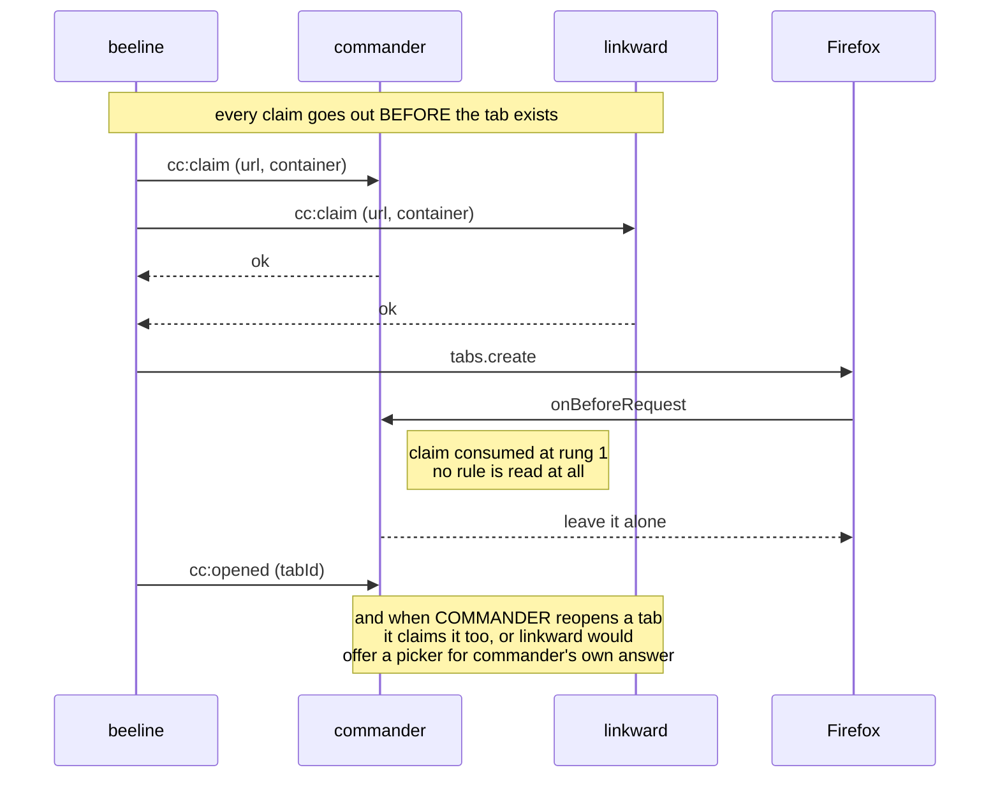

# The claim protocol

Four message types. **A fifth is a design discussion, not a patch** — config
languages and wire protocols die by one reasonable addition at a time.

Transport is `runtime.sendMessage(targetExtensionId, msg)` /
`runtime.onMessageExternal`. Verified: this works between two Firefox extensions
with no manifest key on either side, and `sender.id` is assigned by the browser,
so the receiver can trust who is talking.

## Why it exists

No extension can see which extension opened a tab. That is not an oversight to
work around; it is the platform boundary. So provenance has to be _announced_,
and the announcement has to arrive **before** the tab exists — after is a race,
and the race has no defined winner.

## The participants

A fixed allowlist of three ids in reviewed config. No discovery, no relay.

|                                        |                                  |
| -------------------------------------- | -------------------------------- |
| `container-commander@sapn95.github.io` | the arbiter                      |
| `linkward@sapn95.github.io`            | links from outside → asks        |
| `beeline@sapn95.github.io`             | app launcher → per-app container |

## The messages

### `cc:claim`

> "I am about to create a tab for this URL in this container. It is mine."

```js
{ type: 'cc:claim', url: 'https://example.com/x', cookieStoreId: 'firefox-container-2' }
→ { ok: true }
```

**Sent before `tabs.create`, and awaited.** The sender must not create the tab
until the promise settles — with a short timeout (~200 ms) after which it
proceeds anyway, because a peer being absent is the normal case and everything
must degrade to standalone behaviour.

The claim is stored counted and URL-keyed, so two concurrent launches of
different URLs do not cancel each other, and two of the _same_ URL are consumed
in order.

`cookieStoreId` must be the **actual** store the sender ended up using, not the
one it hoped for. A launcher without container permission must claim
`firefox-default` rather than the container it could not use — claiming a
container you did not open is worse than not claiming.

### `cc:release`

> "That claim will not be used after all."

```js
{ type: 'cc:release', url: 'https://example.com/x' }
```

Sent when `tabs.create` fails. Without it a stale claim sits in the map until
its TTL and swallows the _next_ genuinely external link at that URL — a bug
linkward has already had, in its own claim map, and fixed.

### `cc:opened`

> "That tab now exists and it is id N."

```js
{ type: 'cc:opened', tabId: 42, url: 'https://example.com/x' }
```

Binds the claim to a tab id, which is what makes the tab hands-off for the rest
of its life rather than only for its first request.

### `cc:ping`

The only message that carries a substantive reply.

```js
{ type: 'cc:ping' }
→ { name: 'linkward', version: '0.5.2', revision: 'policy-2026.08.16-a1b2c3d' }
```

`revision` is the loaded **config** revision, and it exists because two
extensions can be running two revisions of the one jurisdiction fact — one
having been reloaded, one not. Commander gates external enforcement on
agreement: a mismatch resolves external rules to leave-alone and raises a
"peer config skew" badge, rather than letting the two disagree silently about
who owns a link.

## Directionality

Who tells whom, so no cooperating extension ever asks about another's tab:



| Sender    | Recipients                            |
| --------- | ------------------------------------- |
| beeline   | commander, linkward                   |
| linkward  | commander                             |
| commander | linkward, **on every tab it creates** |

That last row was an adversarial finding. Without it commander's own freshly
reopened tab — no opener, fresh, http — looks exactly like an external link to
linkward, which would then offer a picker for a tab commander had just
deliberately placed. F2, rebuilt from our own parts.

## Trust and failure

- `sender.id` not on the allowlist → ignored silently. Not an error: other
  extensions are allowed to exist.
- A malformed message → ignored, logged.
- No reply / timeout → the sender proceeds. **Absence is the normal case.**
- Commander in inert mode (no config) still **arms the claim receiver**, so a
  broken config does not break the peers.

## The invariants worth testing

1. No `tabs.create` is issued before the claim promise settles.
2. A claim TTL expiry never turns into an _asking_ decision — only into
   leave-alone.
3. A claim outranks every rule, including deterministic external ones.
4. A released claim cannot be consumed.
5. Two concurrent claims for different URLs never consume each other's entry.
6. A claim for a tab id that Firefox later reuses does not make the new tab
   hands-off.
