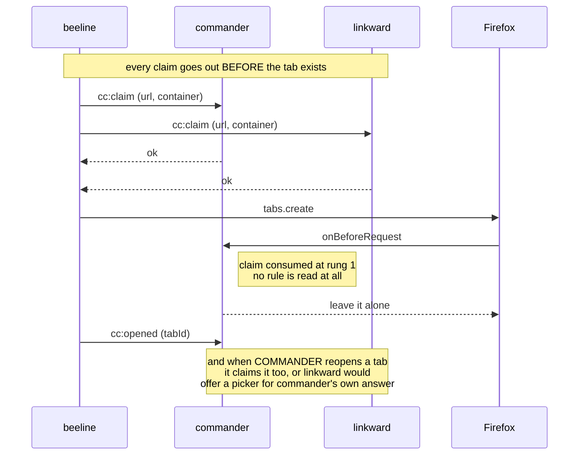

# The claim protocol

Four message types. **A fifth is a design discussion, not a patch** — config
languages and wire protocols die by one reasonable addition at a time.

Transport is `runtime.sendMessage(targetExtensionId, msg)` /
`runtime.onMessageExternal`. Verified: this works between two Firefox extensions
with no manifest key on either side, and `sender.id` is assigned by the browser,
so the receiver can trust who is talking.

## Why it exists

No extension can see which extension opened a tab. That is not an oversight to
work around; it is the platform boundary. So provenance has to be _announced_,
and the announcement has to arrive **before** the tab exists — after is a race,
and the race has no defined winner.

## The participants

A fixed allowlist of three ids in reviewed config. No discovery, no relay.

|                                        |                                  |
| -------------------------------------- | -------------------------------- |
| `container-commander@sapn95.github.io` | the arbiter                      |
| `linkward@sapn95.github.io`            | links from outside → asks        |
| `beeline@sapn95.github.io`             | app launcher → per-app container |

## The messages

### `cc:claim`

> "I am about to create a tab for this URL in this container. It is mine."

```js
{ type: 'cc:claim', url: 'https://example.com/x', cookieStoreId: 'firefox-container-2' }
→ { ok: true }
```

**Sent before `tabs.create`, and awaited.** The sender must not create the tab
until the promise settles — with a short timeout (~200 ms) after which it
proceeds anyway, because a peer being absent is the normal case and everything
must degrade to standalone behaviour.

The claim is stored counted and URL-keyed, so two concurrent launches of
different URLs do not cancel each other, and two of the _same_ URL are consumed
in order.

`cookieStoreId` must be the **actual** store the sender ended up using, not the
one it hoped for. A launcher without container permission must claim
`firefox-default` rather than the container it could not use — claiming a
container you did not open is worse than not claiming.

### `cc:release`

> "That claim will not be used after all."

```js
{ type: 'cc:release', url: 'https://example.com/x' }
```

Sent when `tabs.create` fails. Without it a stale claim sits in the map until
its TTL and swallows the _next_ genuinely external link at that URL — a bug
linkward has already had, in its own claim map, and fixed.

### `cc:opened`

> "That tab now exists and it is id N."

```js
{ type: 'cc:opened', tabId: 42, url: 'https://example.com/x' }
```

Binds the claim to a tab id, which is what makes the tab hands-off for the rest
of its life rather than only for its first request.

### `cc:ping`

The only message that carries a substantive reply, and the only one anybody
_asks_ rather than announces.

```js
{ type: 'cc:ping' }
→ {
    id: 'linkward@sapn95.github.io',
    name: 'linkward',
    version: '0.5.2',
    revision: 'policy-2026.08.16-a1b2c3d',
    routing: true,              // I would reopen a navigation I saw right now
    dryRun: false,              // …or I would decide and cancel nothing
    routes: ['*.example.com'],  // the host patterns, for a human to compare
  }
```

`revision` is the loaded **config** revision, and it exists because two
extensions can be running two revisions of the one jurisdiction fact — one
having been reloaded, one not. Commander gates external enforcement on
agreement: a mismatch resolves external rules to leave-alone and raises a
"peer config skew" badge, rather than letting the two disagree silently about
who owns a link.

#### `routing`, and why it is fields on this message rather than a fifth verb

Two extensions that both hold a **blocking** `onBeforeRequest` both receive the
same request. If both answer `{cancel: true}` and open a replacement, Firefox
carries out both: one navigation becomes **two tabs**, same address, same
container, every time. Nothing in either extension can see that happening — the
platform offers no way to enumerate another extension's webRequest listeners, and
`management` would want a permission whose warning is worse than the bug.

So it is asked. Each participant answers honestly for itself, and each shows the
answer in its own settings UI — see the census in
[`src/lib/census.js`](../src/lib/census.js).

`routing` means one thing and all of these have to be true for it: the watch
grant is held and the listener is on, a policy is loaded, and nothing has paused
it. A **dry run** is reported separately rather than folded in, because it
cancels nothing and so cannot produce a pair — but "this will clash the moment
you switch it on" is worth seeing before you switch it on.

`routes` publishes host **patterns**, and reduces a regex rule to `rule:<id>`. The
list is read by a person deciding which of two add-ons to switch off; a page of
escaped alternations does not help them do that, and shipping one into another
extension's UI would leak policy detail for no gain.

**A peer may act on this reply, not merely display it.** linkward releases a
request untouched when a peer that answered `routing: true` published a pattern
covering its host, which ends the pair on those hosts without anybody pressing
anything. Three consequences for anyone answering a ping:

- Answering `routing: true` while cancelling nothing is the expensive lie. A peer
  that stands down for it leaves the link to an extension that has already stood
  down, and the tab opens in no container at all — the same failure as the pair,
  and quieter. This is why a dry run reports `routing: false`, and why `paused`
  and the missing watch grant are both folded into that one word.
- A host in `routes` is a claim that this extension acts on it. commander's list
  comes from the policy's rules, so a host it reopens from a bookmark-folder hint
  with **no rule matched** appears in no route list — a peer still asks about
  those, and the warning is right to stay up.
- Silence is read as "not routing", by the warning and by the stand-down alike.
  Both listeners are registered synchronously so a sleeping event page can be
  started for the ping, which is what makes that reading safe.

This is deliberately an **extension of the reply**, not a new message. The
protocol is frozen at four verbs on purpose, and `cc:ping` is already the
introspection one — adding fields to what introspection returns keeps the count
at four and keeps the answer in one place.

Overlap is not set intersection. `*.example.com` and `docs.example.com` never
compare equal, and **that pair is the bug** — see F8. The comparison treats a
wildcard as covering both its subdomains and its apex, and reports the match
under the more specific of the two, because that is the string somebody can
search their own settings for.

### What the protocol cannot see

An add-on that does not answer `cc:ping` is indistinguishable from one that is
not installed, so a clean census means "nothing that speaks to me is routing"
and never "nothing else is routing". Multi-Account Containers is the standing
example: `<all_urls>`, a blocking listener, a list of site assignments, no
protocol. See F9.

Those are found by CAPABILITY instead, through the optional `management`
permission — `contextualIdentities`, or `webRequestBlocking` with a host pattern
that reaches the web. Never by a list of known ids, which is wrong the first time
somebody installs the next container add-on.

It reports what an add-on CAN do and never what it is doing. Only a participant
can answer the second, which is the whole reason this protocol exists.

## Directionality

Who tells whom, so no cooperating extension ever asks about another's tab:


```mermaid
sequenceDiagram
    participant B as beeline
    participant C as commander
    participant L as linkward
    participant FF as Firefox

    Note over B,L: every claim goes out BEFORE the tab exists
    B->>C: cc:claim (url, container)
    B->>L: cc:claim (url, container)
    C-->>B: ok
    L-->>B: ok
    B->>FF: tabs.create
    FF->>C: onBeforeRequest
    Note right of C: claim consumed at rung 1<br/>no rule is read at all
    C-->>FF: leave it alone
    B->>C: cc:opened (tabId)
    Note over C,L: and when COMMANDER reopens a tab<br/>it claims it too, or linkward would<br/>offer a picker for commander's own answer
```

| Sender    | Recipients                            |
| --------- | ------------------------------------- |
| beeline   | commander, linkward                   |
| linkward  | commander                             |
| commander | linkward, **on every tab it creates** |

That last row was an adversarial finding. Without it commander's own freshly
reopened tab — no opener, fresh, http — looks exactly like an external link to
linkward, which would then offer a picker for a tab commander had just
deliberately placed. F2, rebuilt from our own parts.

## Trust and failure

- `sender.id` not on the allowlist → ignored silently. Not an error: other
  extensions are allowed to exist.
- A malformed message → ignored, logged.
- No reply / timeout → the sender proceeds. **Absence is the normal case.**
- Commander in inert mode (no config) still **arms the claim receiver**, so a
  broken config does not break the peers.

## The invariants worth testing

1. No `tabs.create` is issued before the claim promise settles.
2. A claim TTL expiry never turns into an _asking_ decision — only into
   leave-alone.
3. A claim outranks every rule, including deterministic external ones.
4. A released claim cannot be consumed.
5. Two concurrent claims for different URLs never consume each other's entry.
6. A claim for a tab id that Firefox later reuses does not make the new tab
   hands-off.
